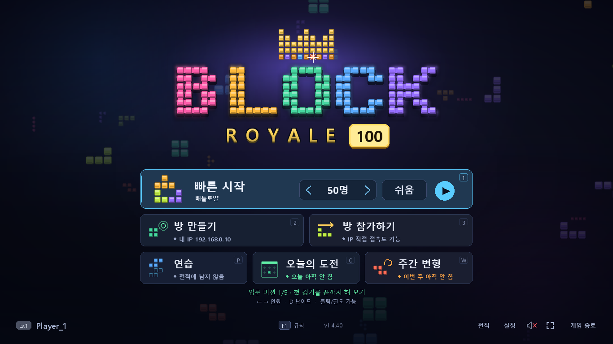

# BLOCK ROYALE 100 (배틀로얄 블록 퍼즐)

2명부터 최대 100명까지 대전할 수 있는 서버리스(Serverless) UDP 멀티플레이 배틀로얄 블록 퍼즐 게임입니다.



---

## 🎮 게임 특징 및 화면 구성

1. **중앙 메인 블록 보드 (내 플레이 창)**:
   - 10x20 크기의 풀 해상도 블록 보드.
   - 홀드(Hold, C키/Shift), 넥스트 큐(Next 5개 미리보기), 고스트 블록(Ghost Piece) 제공.
   - 쓰레기 라인 경고 바(Garbage Warning Bar)로 들어오는 공격 실시간 확인: 아래(초록)에서 위(빨강)로 차오르고, 공격을 받으면 잠깐 **차징**(어둡게 표시) 동안 올라오지 않아 그 사이 줄을 지워 막을 수 있습니다.
   - 경기 단계(생존자 수)에 따라 배경과 테두리 색이 파랑 → 보라 → 붉은 톤으로 바뀝니다. 블록 모양(스킨)은 설정에서 고를 수 있습니다.
2. **주변 미니 보드 (최대 99개 화면)**:
   - 좌/우로 분할되어 최대 99명의 상대방(UDP 네트워크 플레이어 및 AI 봇) 화면이 실시간으로 축소 렌더링됩니다.
   - 탈락 시 순위 표시로 K.O. 처리. 상대 생존자가 20/10/5명 이하가 되면 살아남은 사람만 다시 배치해 더 크게 보여줍니다.
   - 내가 조준 중인 상대방은 **붉은색/금색 테두리**로 하이라이트됩니다.
   - 공격이 오갈 때 화려한 레이저 광선 궤적이 표시됩니다.
3. **서버리스 P2P UDP 네트워크**:
   - 별도의 전용 중앙 서버 없이, **하나의 프로그램에서 호스트(Host)와 클라이언트(Client)** 모드를 모두 지원합니다.
   - 로컬 네트워크(LAN) 자동 방 검색(Auto-Discovery) 비콘 기능 탑재.
4. **연습 모드 / 오늘의 도전 / 난이도 사다리**:
   - 메인 메뉴의 **연습**(`P`): 혼자 연습하며 `G`로 쓰레기 줄을 받아 보고 `B`로 보드를 초기화합니다 (전적 미기록). 줄을 지울 때 보냈을 공격력이 표시되고, 위 칸에 연습 과제 4개(상쇄·쿼드·3콤보·T-스핀)가 나옵니다. 탈락 결과·순위표·관전 중에도 `P`로 바로 연습을 시작합니다.
   - **오늘의 도전**(`C`): 하루에 한 번 정해지는 같은 블록 순서·같은 상대(100인)로 내 순위를 겨룹니다.
   - 50인 이상 대전에서 10위 안에 들면 그 봇 난이도를 클리어(★)하고, 결과 화면(우승·상위권이라 순위표로 바로 넘어가는 경우는 순위표 위)에 다음 목표와 최고 기록·업적 달성이 표시됩니다.
5. **2인 ~ 100인 가변 배틀로얄 & 경량 고성능 AI 봇**:
   - 2인 1:1 대전부터 100인 풀 배틀로얄까지 원하는 인원수로 설정 가능.
   - 참가하지 않은 빈자리는 60FPS로 최적화된 블록 AI 봇들이 자동으로 충원되어 혼자서도 언제든 99명의 봇과 100인 배틀을 즐길 수 있습니다.

---

## 🕹 조작 키 안내

| 조작 | 키보드 키 |
| :--- | :--- |
| **좌 / 우 이동** | `←` / `→` (키를 꾹 누르고 있으면 빠른 연속 이동 - DAS 지원) |
| **소프트 드롭 (빠른 낙하)** | `↓` |
| **하드 드롭 (즉시 바닥 착지)** | `스페이스바 (Space)` |
| **블록 시계방향 회전** | `↑` 또는 `X` |
| **블록 반시계방향 회전** | `Z` |
| **블록 홀드 (Hold)** | `C` 또는 `좌측 Shift` |
| **타겟팅 전략 변경** | `TAB` (AUTO ➔ K.O. ➔ ATTACKERS ➔ BADGES ➔ RANDOM, 상단 HUD 칩으로 현재 모드 표시) |
| **수동 상대방 지정** | `마우스 좌클릭` (화면 좌/우의 미니 보드를 직접 클릭) |
| **일시정지 (Pause)** | `P` (싱글 플레이 시 일시정지 / 재개 토글) 또는 `ESC` |
| **연습 모드 전용** | `G` 쓰레기 4줄 받기 (`Shift+G` 8줄) · `B` 보드 초기화 |
| **전체화면 토글** | `F11` (전체화면 / 창모드 전환) |
| **음소거 토글** | `M` (효과음 On / Off) |
| **메뉴로 나가기** | `ESC` |

---

## 🚀 실행 방법

### 1. 패키지 요구사항
Python 3.10+ 및 `pygame-ce`, `numpy`:
```bash
pip install -r requirements.txt
```

### 2. 게임 실행
```bash
cd <이 폴더 경로>
python main.py
```

---

## 🌐 멀티플레이 이용 방법

### [방법 1] 100인 빠른 시작 (혼자서 99명 AI 봇과 배틀)
1. 메인 메뉴에서 `[1] QUICK PLAY` (숫자 1키)를 누르면 설정한 인원·난이도로 바로 AI 봇 대전이 시작됩니다. (기본 설정은 100인 혼합 난이도이고, 처음 설치하면 50인·쉬움 봇으로 시작합니다. 혼자 하는 경기는 시작 전 3-2-1 카운트다운이 있습니다.)
2. 메인 메뉴에서 `←` / `→` 방향키로 총 인원수를 2명 ~ 100명까지 자유롭게 변경할 수 있습니다.

### [방법 2] 호스트 모드 (방 만들기)
1. 한 사람이 메인 메뉴에서 `[2] HOST ROOM` (숫자 2키)을 누릅니다.
2. 화면 상단에 표시되는 본인의 로컬 IP(예: `192.168.x.x:19999`)를 다른 친구에게 알려줍니다.
3. 로비 화면에서 친구들이 들어오는 것을 확인한 후, `[ENTER]` 키를 누르면 게임이 시작됩니다.
   - (참가자가 부족하면 남은 자리는 AI 봇이 자동으로 채워줍니다!)

### [방법 3] 클라이언트 모드 (방 참가)
1. 다른 사람이 메인 메뉴에서 `[3] JOIN ROOM` (숫자 3키)을 누릅니다.
2. 같은 Wi-Fi나 LAN에 있다면 `Discovered LAN Rooms` 목록에 호스트의 방이 자동으로 나타납니다. **해당 방을 마우스로 클릭**하면 즉시 접속됩니다.
3. 또는 입력창에 호스트 IP를 직접 타이핑하고 `[ENTER]`를 누르면 접속됩니다.
4. 호스트가 게임을 시작하면 자동으로 게임 화면으로 동기화 전환됩니다.

---

## ⚔ 배틀로얄 및 쓰레기 라인 공격 규칙

- **라인 클리어 공격력**:
  - 1줄 클리어: 공격 0 (수비만)
  - 2줄 클리어: 1줄 전송
  - 3줄 클리어: 2줄 전송
  - 4줄 클리어 (쿼드): 4줄 전송
  - 연속 콤보(Combo) 시 추가 보너스 공격 라인 발생!
  - **퍼펙트 클리어(PERFECT CLEAR)**: 줄을 지워 보드 위 블록이 하나도 남지 않으면 **+10줄 보너스 공격**과 화려한 연출, 전용 효과음, 전광판 중계가 나옵니다.
- **공격 상쇄 (Counter / Offset)**:
  - 상대방에게 공격을 받아 쓰레기 라인이 쌓이고 있을 때 라인을 지우면, **들어오는 공격을 먼저 깎아내어 방어**할 수 있습니다.
- **타겟팅 전략 (`TAB` 키로 순환, 숫자 `1`~`5` 키로 바로 선택: 자동/K.O./반격/배지/랜덤)**:
  - `RANDOM`: 생존자 중 무작위 1명을 타겟
  - `AUTO`(자동): 가장 위험한 상대를 겨누되 한 번 고른 대상은 최소 0.8초 유지하고, 받을 공격 대기열이 가득 찬 상대는 건너뜁니다. 조준 칸 아래 막대는 대상의 위험도입니다.
  - `K.O.`: 블록이 높게 쌓여 탈락 위기에 처한 상대를 집중 공격
  - `ATTACKERS`: 현재 나를 노리고 있는 적들에게 반격. **나를 노리는 적이 2명 이상이면 전원(최대 4명)에게 같은 공격이 동시에 발사**됩니다(다중 포격).
  - `BADGES`: 가장 많은 K.O. 킬을 달성한 강자를 견제

---

## 📦 실행 파일(exe)

- `release/BlockRoyale100.exe` 하나만 있으면 Python 설치 없이 실행됩니다 (Windows 10/11 64비트).
- 설정과 전적은 `%APPDATA%\BlockRoyale100\` 폴더(`settings.json`, `stats.json`)에 저장됩니다. 이 폴더를 지우면 초기화됩니다.
- 직접 빌드하려면: `pip install -r requirements.txt pyinstaller` 후 `build_exe.bat` 실행.
- 방 만들기/참가는 UDP 19999 포트를 씁니다. 처음 실행할 때 Windows 방화벽 허용 창이 나오면 "허용"을 눌러야 다른 PC와 연결됩니다.
- 실행 파일 점검: `BlockRoyale100.exe --selftest` (창 없이 초기화/렌더링을 검사하고 `%APPDATA%\BlockRoyale100\selftest.log`에 결과 기록).
- 버전 확인: `BlockRoyale100.exe --version` (메인 화면 왼쪽 아래에도 표시).
- 오류가 나서 게임이 꺼지면 원인이 `%APPDATA%\BlockRoyale100\error.log`에 기록되고 안내 창이 뜹니다. 문제를 알릴 때 이 파일을 함께 주세요.
- 인터넷(다른 공유기)으로 접속하려면 호스트 쪽 공유기에서 UDP 19999 포트를 호스트 PC로 포트포워딩해야 합니다. 공유기가 여러 단계이거나 어렵다면 ZeroTier/Radmin VPN 같은 가상 LAN을 쓰고 그 가상 IP로 접속하세요.

---

## 📖 매뉴얼

- `BLOCK_ROYALE_100_MANUAL.html`: 조작·규칙·설정을 실제 게임 화면 캡처와 함께 설명하는 오프라인 매뉴얼입니다. 브라우저로 열면 되고, 릴리스마다 exe와 함께 첨부됩니다.

---

## 🗂 코드 구조

- `main.py`: 앱 초기화, 메인 루프, 이벤트 분배 (약 450줄)
- `screens/`: 화면별 믹스인 — `menu`, `lobby`(방 만들기/참가/대기실), `settings`, `records`, `game`(게임 화면 입력/갱신), `modal`(확인 창), `text_input`(채팅/이름 입력), `widgets`(공용 UI 부품), `core`(창/해상도/게임 시작·종료)
- `app_common.py`: 여러 모듈이 함께 쓰는 import/헬퍼, `menu_background.py`: 메인 화면 배경 애니메이션
- 엔진/로직: `block_engine.py`, `ai_bot.py`, `battle_royale.py`, 네트워크 `network.py`, 렌더링 `ui_renderer.py` + `gfx.py`, 소리 `sound_fx.py`

---

## 📝 문서

- 개발일지(버전별 devlog·CHANGELOG·사용 설명서)는 `docs/` 폴더에 있습니다. 개발 중 참고용 문서라 이 저장소에는 올리지 않습니다(`.gitignore`).

---

## 🧪 개발 · 테스트

- 전체 테스트: `python run_all_tests.py` (엔진, 배틀 로직, 네트워크 루프백, 설정/전적 손상 복구, 화면 렌더링 스모크 테스트 + 정적 검사). 하나라도 실패하면 종료 코드 1.
- 개별 실행: `tests/test_engine_fixes.py`, `tests/test_royale.py`, `tests/test_v24_perfect_score.py`, `tests/test_review_network.py`/`bot`/`ui`/`data`/`rules`, `tests/test_opus_review2.py`, `tests/test_render_smoke.py` (프로젝트 루트에서 실행).
- GitHub에 올리면 `.github/workflows/tests.yml`이 push마다 테스트를 자동 실행합니다.

---

## ⚖️ 라이선스 및 고지

- 이 프로젝트의 소스 코드는 [MIT License](LICENSE)로 제공됩니다.
- 사용한 서드파티 라이브러리(pygame-ce, numpy 등)의 라이선스는 [THIRD_PARTY_NOTICES.md](THIRD_PARTY_NOTICES.md)를 참고하세요.
- **BLOCK ROYALE 100은 독립적으로 제작된 프로젝트이며, 어떤 상용 블록 퍼즐 게임이나 그 상표권자와도 제휴·후원·승인 관계가 없습니다.**
  게임 내 모든 그래픽(로고, 블록 색상, UI)은 코드로 직접 그린 것이고, 사운드는 코드로 합성한 것입니다.
